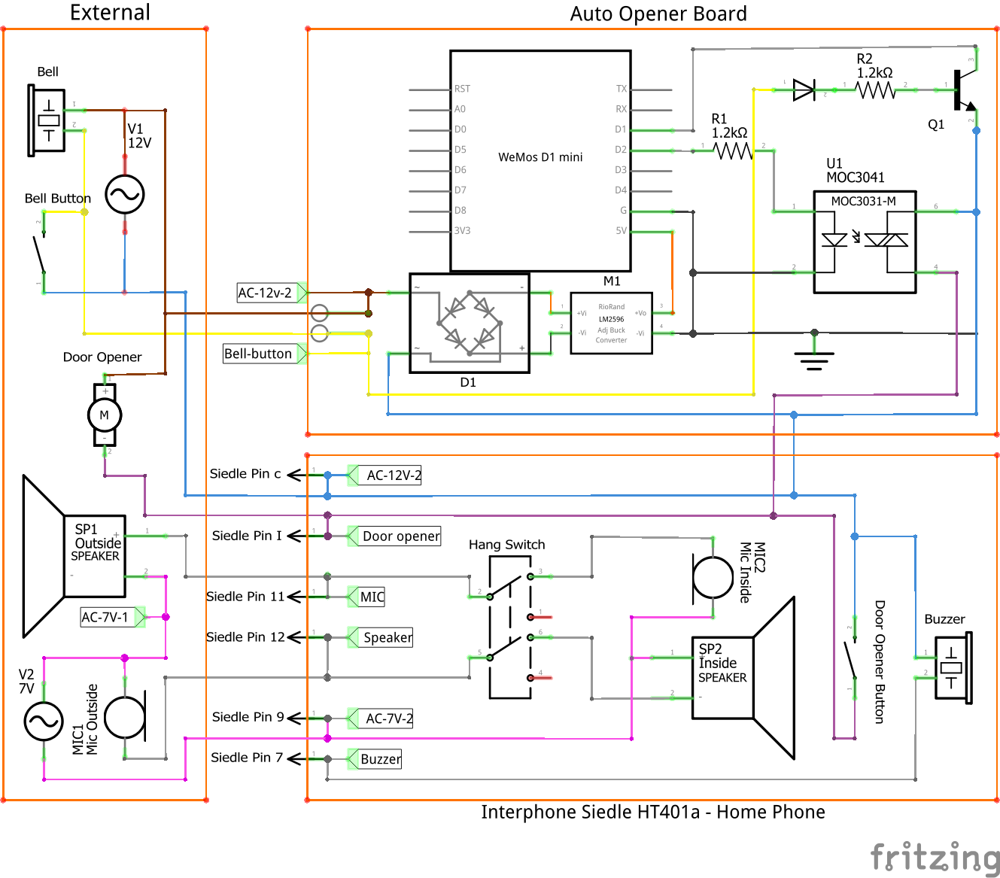
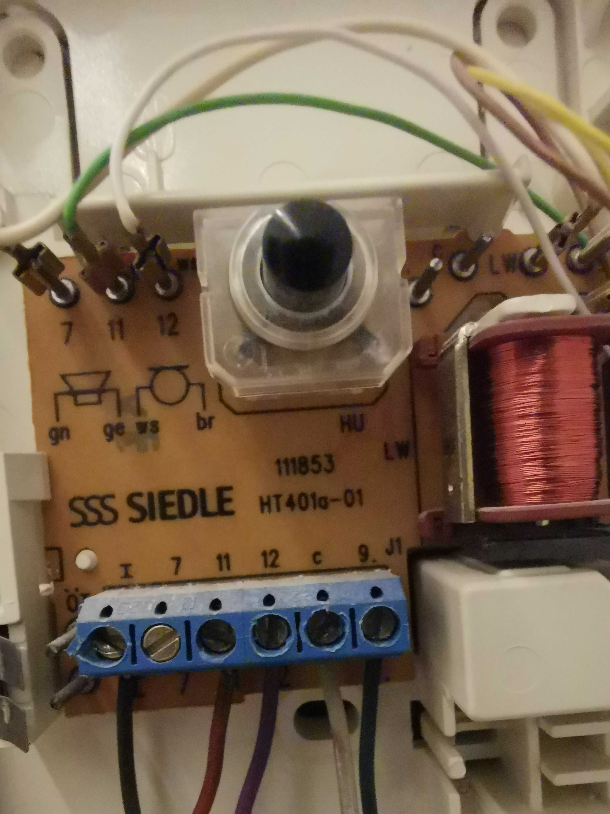

# Automation for Siedle HT401a interphone

This device can be added to a Siedle HT401a interphone in order to open doors automatically and via home assisstant. It is powered from the Interphone and detects when the bell is ring.

## Version 1
This version was manually built (no PCB).

The D1 PIN is used to detect when the bell button is presssed. When the button is not pressed 12v AC is applied to the transistor. This results on the D1 input pull-up pin to move oscillate between 1 and 0. These oscilations are filtered in the esphome firmware so a non-pressed is reported when an 1 is detected in one second at least in. When the button is pressed the D1 pin remains at 0 and after one second reported ass pressed. The other pin of the bell button is connected to GND.

The D2 ping controls the solid state relay which opens the door.

- Features
  - If bell buttons is pressed 2 seconds or longer it opens door automatically
  - When bell button is pressed secondary bell is ringed via mqtt broker
- [Fritzing schematics](Fritzing/Schematics.fzz)
  - [Schematics Preview SVG](pictures/Schematics_schem.svg)
  - 
- Components:
  - Interphone: Siedle HT401a
    - 
  - WeMos D1 mini (programmed with esphome)
  - Power Regulator
  - 1x [MOC3041 - 400V 1A Zero-Cross Triac](https://cdn.sos.sk/productdata/61/2a/8c2cd9a7/moc-3041.pdf)
  - 1 transistor NPN (could be replaced by second optocoppler)
  - 2 resistences of 1-2 K Ohms