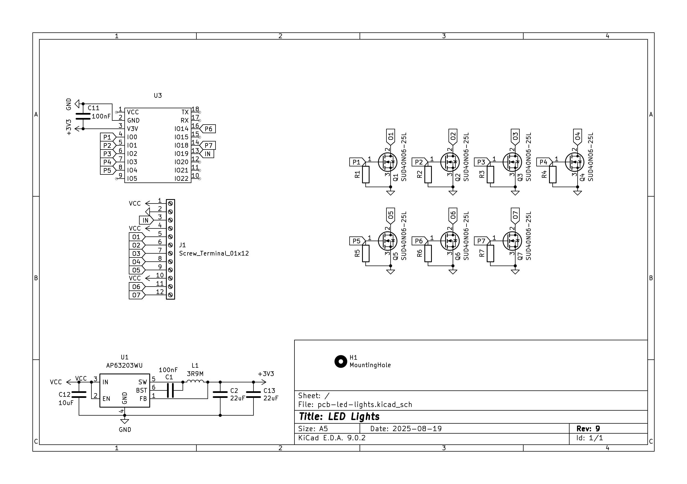
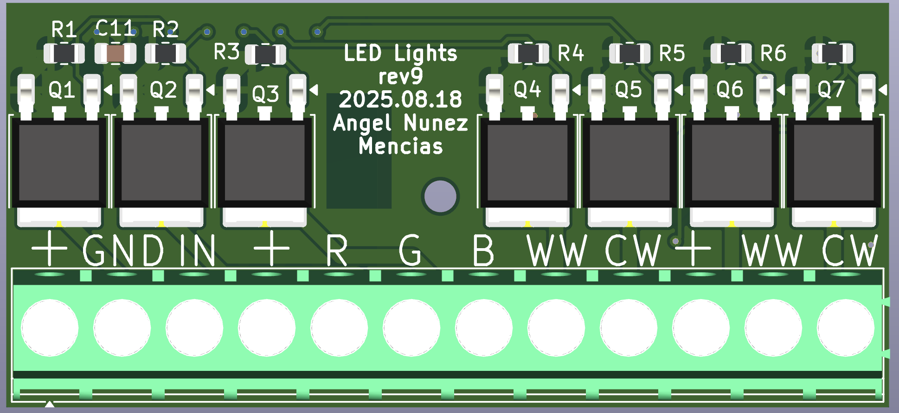
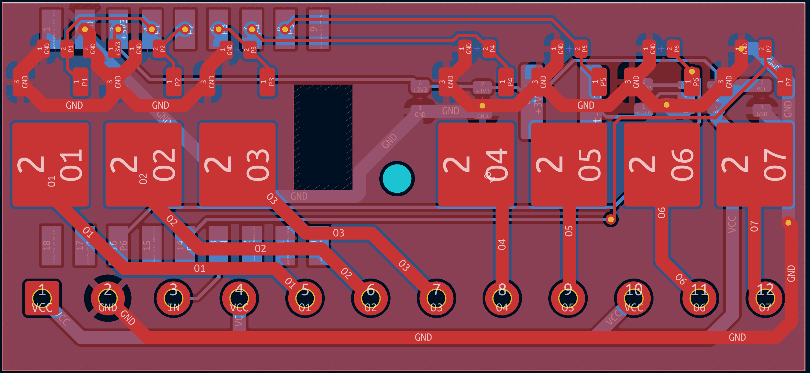
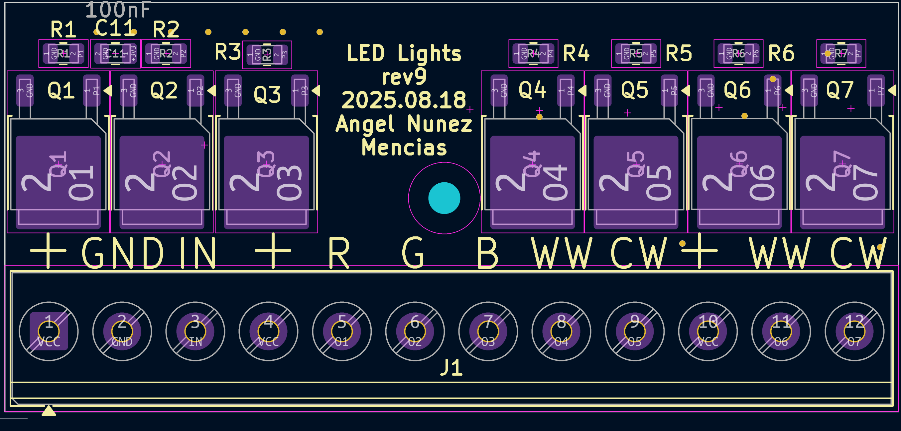
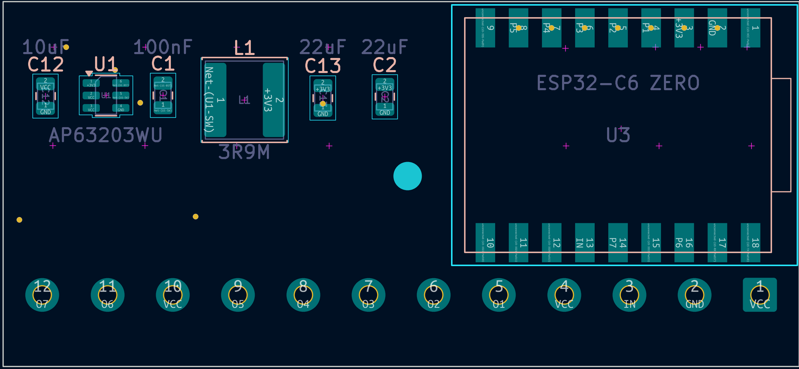
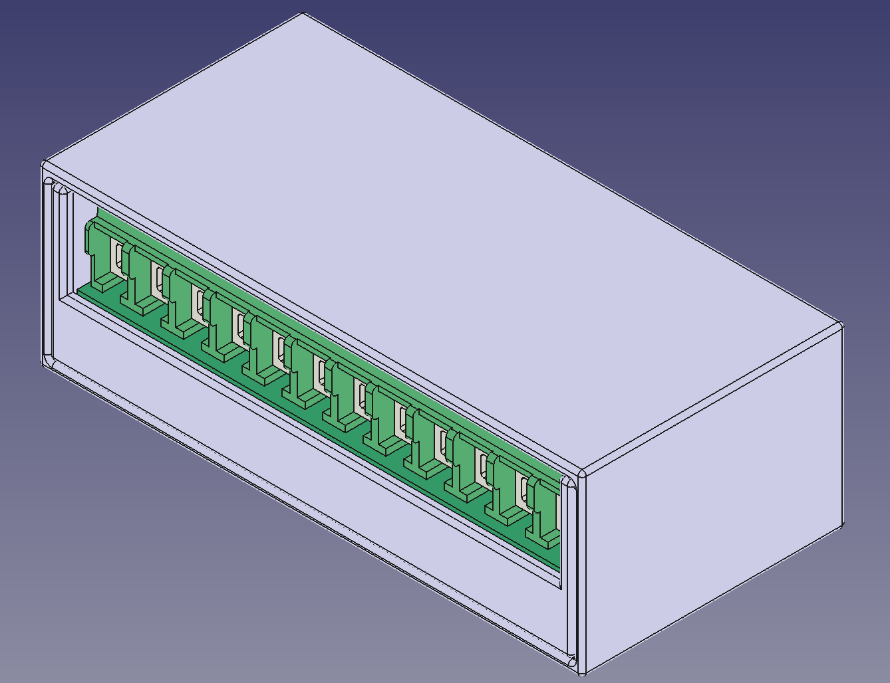

# USB Power controller

This PCB allows controlling 7 LED stripe channels up to 24V and 10A per channel. I use it to control an RGBCWWW color stripe and a CWWW white stripe with the same device.

[Aisler PCB project](https://aisler.net/p/KIGTGSCT) - I order my PCBs here.

KiCad PCB - schematics and assembly 

- [KiCad PCB project](KiCad/pcb-led-lights/pcb-led-lights.kicad_pro)
- 
- 
- 
- 
- 
- 
  

3D Printed Box 

- [3D Printed box](FreeCAD)
- [FreeCad file](FreeCAD/pcb-led-lights.FCStd)
  - fix PCB with 3x M2 screws up to 7mm long
  - use up to 3x 3mm wide screws to fix to the wall
  - cover slack: 0.15 mm (enough that it holds without screws)
  - all parameters of the box are in the Settings Spreadsheet that you can change with FreeCAD if you need to
    adjust to your case
- [3MF file - small box](FreeCAD/pcb-led-lights-Box.3mf)

Parts

- 1x [ESP32-C6 Zero](https://www.waveshare.com/wiki/ESP32-C6-Zero) - this allows for wifi 6 and reduced components to solder as programer, led and antenna are included
- 1x [AP63203WU-7 Step-Down converter](https://www.mouser.com/datasheet/2/115/DIOD_S_A0007089856_1-2542907.pdf)
- 12x [Screw Terminal blocks](https://www.amazon.de/YIXISI-Terminal-Schraubklemme-Steckverbinder-Arduino/dp/B087RN8FDZ)
- 1x [2,9 uH inductor](https://www.mouser.com/datasheet/2/3/ASPI_0628-1775153.pdf)
- 7x [SUD40N06-25L Power MOSFET](https://www.farnell.com/datasheets/69243.pdf). Can also use [STD35NF06LT4](https://www.st.com/resource/en/datasheet/std35nf06l.pdf)
- 7x 0805 SMD 47 KOhms resistor
- 2x 0805 SMD 100 nF capacitor
- 2x 0805 SMD 22 uF capacitor
- 1x 0805 SMD 10 uF capacitor
  

Firmware

- You need to modify/create your own [ESPHome.io](https://esphome.io) definition and include the [yaml in this folder](rgbww_ww_v2.yaml)
- [Example for v2](TBD)

## ToDos

- [x] v2

## Changelog

### v2

- Complete redesign using an ESP32-C6 for better WiFi and step down to handle 24V (linear regulator was getting to hot in v1)

### v1

- First version

