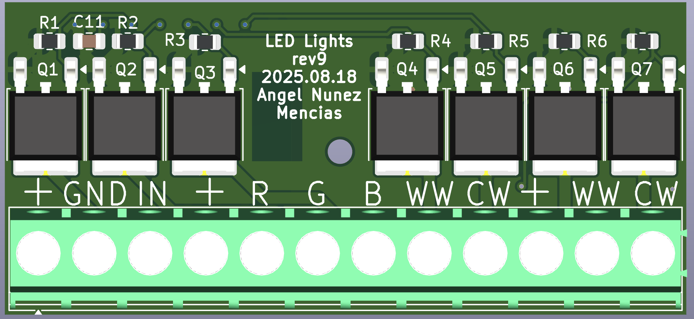
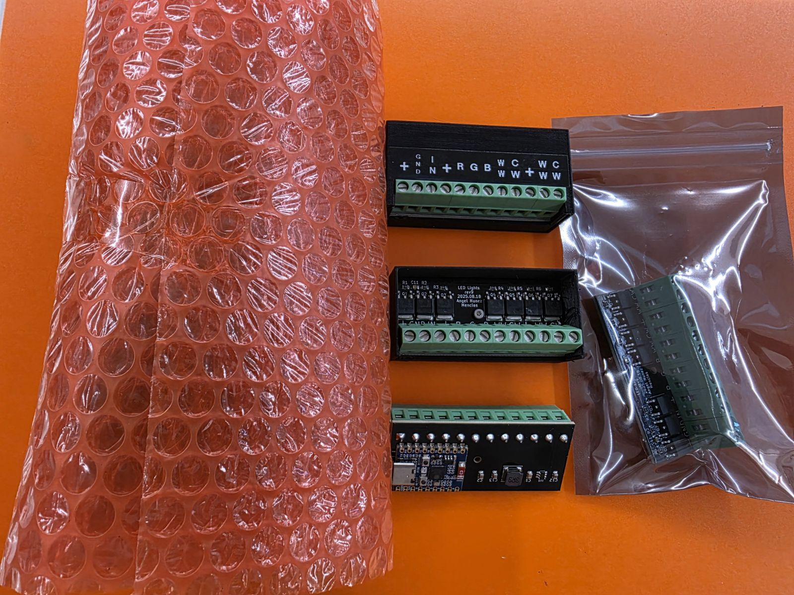
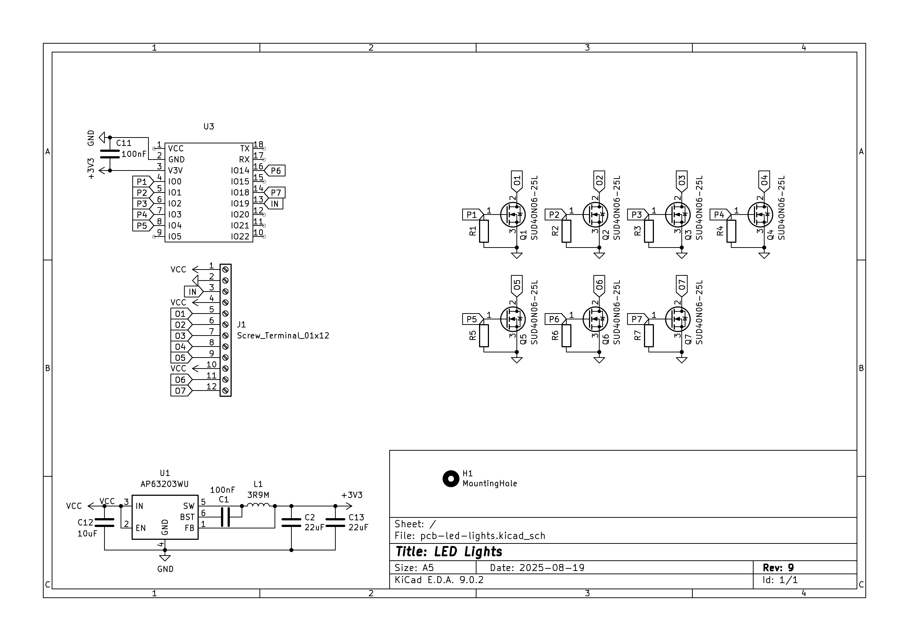
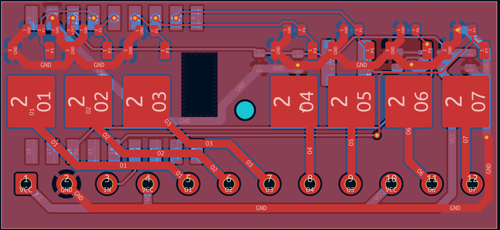
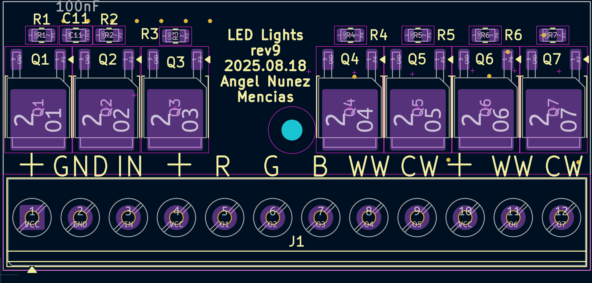
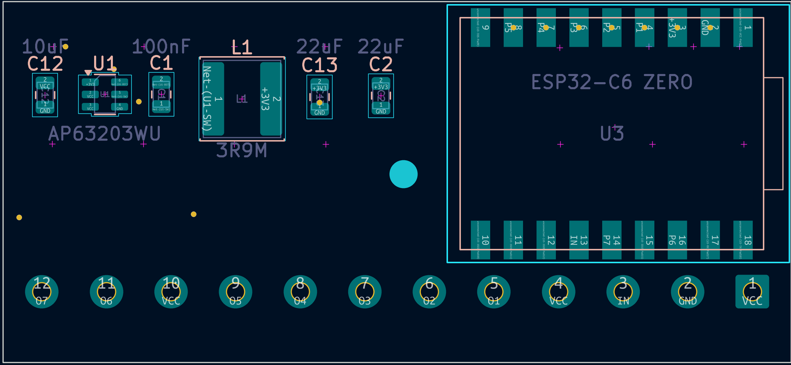
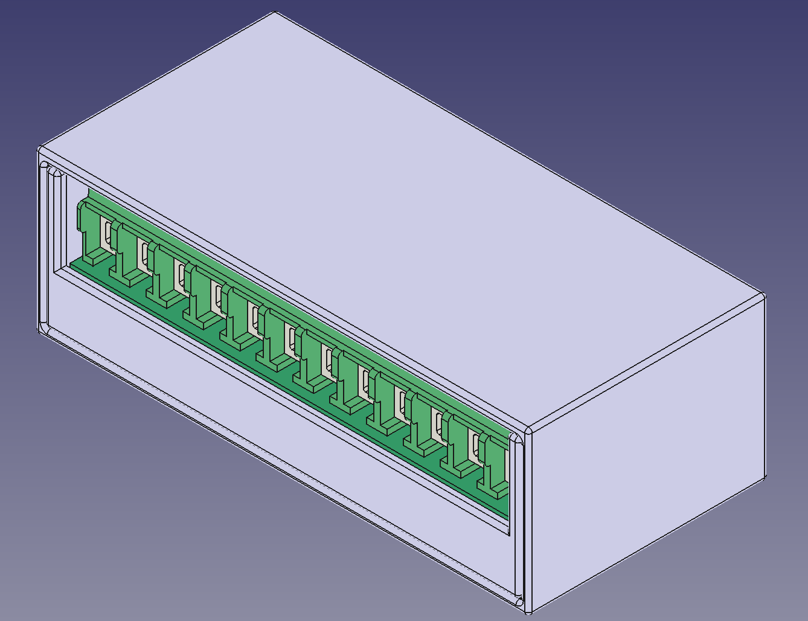

# USB Power controller

This PCB allows controlling 7 LED strip channels up to 24V and 10A per channel. I use it to control a 5x channel RGBCWWW color led strip and a 2x channel CWWW white led strip with the same device. It uses a ESP32-C6 for the improved Wifi and Bluetooth as they are placed typically in locations with bad coverage such as celings and inside walls. I programmed a custom ESPHome component for the Motor Controlled PWM as the C6 and other ESP32 variants do not include enough LEDC channels.

It also includes a push button input so it can be used (limitedly) without connection if needed. If can also be used as Bluetooth proxy (at its Flash memory size). I intend to extend it later on to use Bluetooth Low Energy switches from Shelly so that it does not depend on the Home Assistant automation being available.

I ordered [20x already assembled PCBs from PCBWay](https://www.pcbway.com/project/shareproject/Strip_LED_Controller_for_ESPHome_e175d1c1.html) as I did not want to solder and check so many myself and I installed the whole house with these. PCBWay was kind to sponsor this PCB so here is the resulting project I ordered:

I received within a month for ca 16$ each of the 20x board with most of the cost for the components. The PCBs came wrapped individually (right in the picture above) and then in groups of five (pink wrap left in the picture). It took me a couple of hours to put it in the 3D printed box (which I printed myself but can be ordered from PCBWay as well) and upload the firmware via USB C cable (no serial adapter needed).

The LED from the ESP32 will light green when connecting to Wifi and blue after the connection has been stablished.

I have also [developed an adapter PCB to connect Ikea wardrobe LEDs with the TRÅDFRI system](https://www.printables.com/model/1427264-conector-for-ikea-tradfri).

[Aisler PCB project](https://aisler.net/p/KIGTGSCT) - Alternative PCBs - not tried assembly.

KiCad PCB - schematics and assembly 

- [KiCad PCB project](KiCad/pcb-led-lights/pcb-led-lights.kicad_pro)
- 
- 
- 
- 
- 
- 
  

3D Printed Box 

- [3D Printed box](FreeCAD)
- [FreeCad file](FreeCAD/pcb-led-lights.FCStd)
  - fix PCB with 3x M2 screws up to 7mm long (M2X6mm work great)
  - cover slack: 0.15 mm (enough that it holds without screws)
  - all parameters of the box are in the Settings Spreadsheet that you can change with FreeCAD if you need to adjust to your case
- [3MF file - small box](FreeCAD/pcb-led-lights-Box.3mf)

Parts

- 1x [ESP32-C6 Zero](https://www.waveshare.com/wiki/ESP32-C6-Zero) - this allows for wifi 6 and reduced components to solder as programer, led and antenna are included
- 1x [AP63203WU-7 Step-Down converter](https://www.mouser.com/datasheet/2/115/DIOD_S_A0007089856_1-2542907.pdf)
- 12x [Screw Terminal blocks](https://www.amazon.de/YIXISI-Terminal-Schraubklemme-Steckverbinder-Arduino/dp/B087RN8FDZ)
- 1x [2,9 uH inductor](https://www.mouser.com/datasheet/2/3/ASPI_0628-1775153.pdf)
- 7x [SUD40N06-25L Power MOSFET](https://www.farnell.com/datasheets/69243.pdf). Can also use [STD35NF06LT4](https://www.st.com/resource/en/datasheet/std35nf06l.pdf)
- 7x 0805 SMD 47 KOhms resistor
- 2x 0805 SMD 100 nF capacitor
- 2x 0805 SMD 22 uF capacitor
- 1x 0805 SMD 10 uF capacitor
  

Firmware

- You need to modify/create your own [ESPHome.io](https://esphome.io) definition and include the [yaml in this folder](rgbww_ww_v2.yaml)
- [Example for v2](TBD)

## ToDos

- [x] v2

## Changelog

### v2

- Complete redesign using an ESP32-C6 for better WiFi and step down to handle 24V (linear regulator was getting to hot in v1)

### v1

- First version

