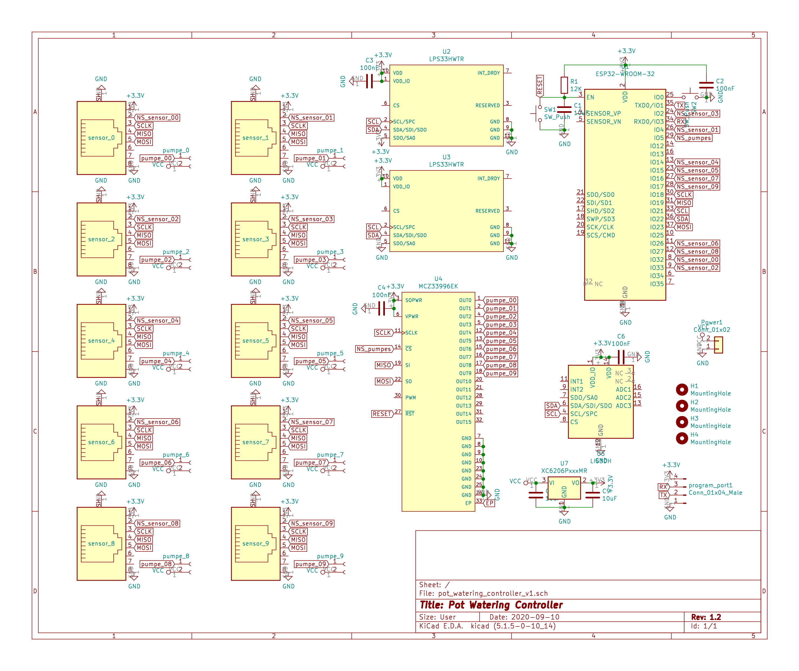
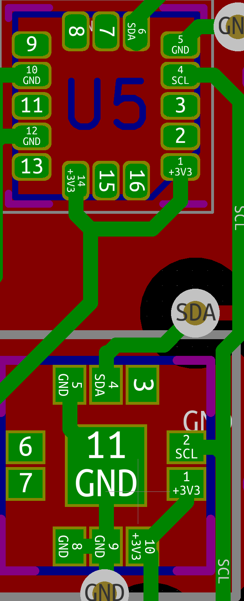

# Pot watering
This PCB allows watering pots with individual sensor and pumpes. The main feature is that the settings are stored in the sensor so you can disconned a pot from the controller and move with its sensor to another contoller: the watering settings will be transported.

TBD: more explanations

## Controller

- [Aisler PCB project](https://aisler.net/p/DESISEWY)
- [KiCad schematics](controller/KiCad/pot_watering_controller_v1.sch)
  - 
- [KiCad PCB](controller/KiCad/pot_watering_controller_v1.kicad_pcb)
  - 
  - 
- Parts:
  - 1x [ESP32-WROOM-32](https://www.espressif.com/sites/default/files/documentation/esp32-wroom-32_datasheet_en.pdf)
  - 2x pression sensors [LPS33HWTR](https://www.st.com/resource/en/datasheet/lps33hw.pdf)
  - 1x accelerometer [LIS3DH](https://www.st.com/resource/en/datasheet/cd00274221.pdf)
  - 1x IC power switch [MCZ33996EK](https://www.nxp.com/docs/en/data-sheet/MC33996.pdf)
  - 6 or 10 [RJ-45 Modular Jack - 98435-111LF](https://www.amphenol-icc.com/modular-jack-98435111lf.html)
  - 6 or 10 connectors
- PINs:
  - Serial programmer:
    1. VCC
    2. RX
    3. TX
    4. GND
 - Power
 - 6 or 10 pumpe power ports
 - 6 or 10 ethernet ports
- Firmwares:
  - [esphome](esphome.io)
    - You need to modify/create your own esphome definition and include the yaml in this folder matching your PCB
    - [Example for v1.1](../../w1-test.yaml)
  - [platformio](platformio.io) For testing without esphome you can use platformio to build and standalone test firmware that will periodically refresh the sensor data and print it to serial
    1. install [platformio](platformio.io)
    2. open a terminal at the [controller folder](controller)
    3. connect your ep32 via serial to your computer
    4. ensure your serial adapter matches the monitoring and programming sections in the [platformio config file](controller/platformio.ini).
    5. run `pio upload`

### Changelog

#### v1.1
  - First version
  - BUGS:
    - TBD

## Sensor
- [Aisler PCB project](https://aisler.net/p/HRCGITXS)
- [KiCad schematics](sensor/KiCad/SoilSensor_spi.sch)
  - 
- [KiCad PCB](sensor/KiCad/SoilSensor_spi.kicad_pcb)
  - 
- Parts:
  - TBD
- PINs:
  - TBD
- Firmware: [platformio](platformio.io)
  1. install [platformio](platformio.io)
  1. open a terminal at the [sensor folder](sensor)
  2. connect your sensor board via [STLink](https://www.st.com/en/development-tools/st-link-v2.html) to your computer
  3. run `pio upload`
- [3D Printed cage](cages):
  - TBD

### Changelog

#### v1.1
  - First version
  - BUGS:
    - TBD
