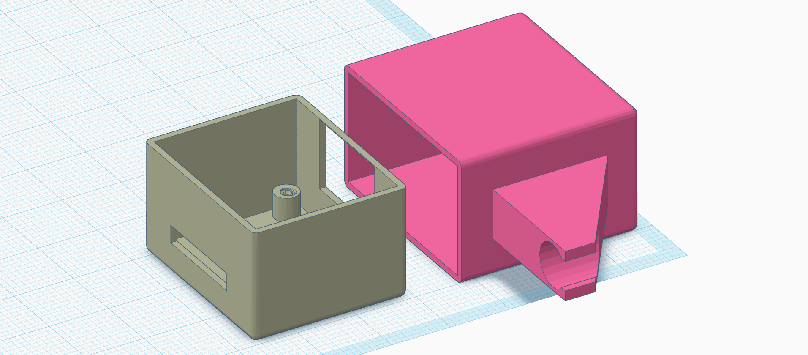

# Box for pot watering sensor
There are 2 files for each pot sensor, box and lid.

## Options used for printing
- Layer height __0.2 mm__
- Nozzle diameter __0.4 mm__
- Material __PETG__

## Mount indications

You would need two 4mm long M2 screws, although it is not entirely necessary because the board and lid are very well fitted in the box.

