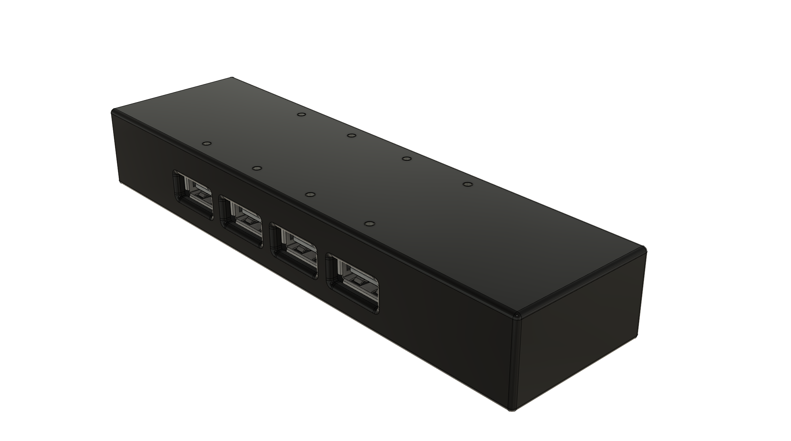
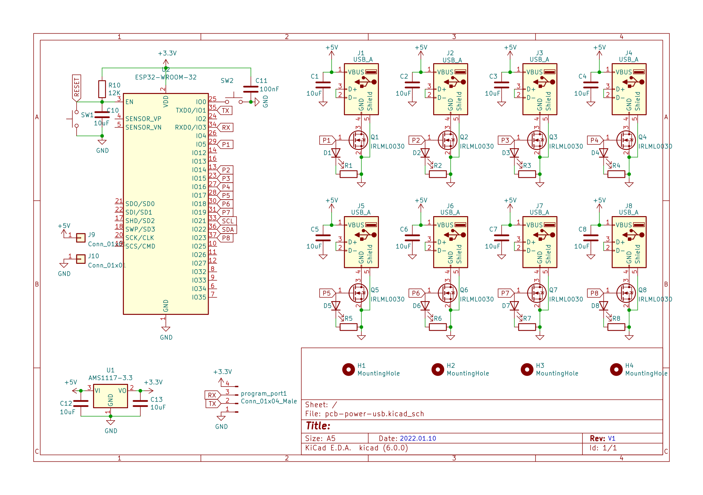
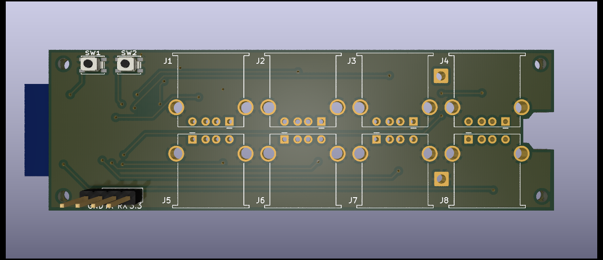
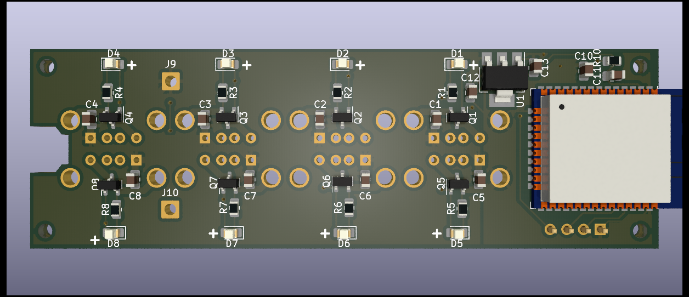

# USB Power controller

This PCB allows providing 5 V for up to 8 USB devices. Each of them can be disabled via esphome. Each USB has an LED to indicate if power is provided.

- 

- [Aisler PCB project](https://aisler.net/p/BQLUSDIS)
- [KiCad PCB](kicad/pcb-power-usb/pcb-power-usb.kicad_pro)
  - 
  - 
  - 
- [3D Printed cage](cage):
  - [Fusion 360 online view](https://a360.co/3qWptNk)
  - [Fusion 360 archive](cage/pcb-power-usb.f3z)

- Parts:
  - 1x [ESP32-WROOM-32](https://www.espressif.com/sites/default/files/documentation/esp32-wroom-32_datasheet_en.pdf)
  - 1x [AMS1117 - 3,3v 1A regulator in SOT-223 format](http://www.advanced-monolithic.com/pdf/ds1117.pdf)
  - 8x [IRLML0030 - 5A N-MOSFET](https://www.infineon.com/dgdl/Infineon-IRLML0030-DataSheet-v01_01-EN.pdf?fileId=5546d462533600a401535664773825df)
  - 8x [USB_A_Stewart_SS-52100-001_Horizontal](https://www.digikey.de/en/products/detail/stewart-connector/SS-52100-001/7902377)
  - 8x 0805 LEDs
  - 8x 0805 LED resistors (depends on selected LED)
  - 1x 10 KOhm resistor (reset)
  - 9x 0805 10 uF capacitor
  - 1x DC 5.5 x 2.1 mm barrel connector
    - Bought from [Amazon](https://www.amazon.de/gp/product/B093FTFZ8Q)
- PINs:
  - Header top left - external temperature sensors. From top to bottom:
    - VCC
    - Data
    - GND
- Firmware: [esphome](esphome.io)
  - You need to modify/create your own esphome definition and include the yaml in this folder matching your PCB
  - [Example for v1.0](../../s13-legos-shelves.yaml)

# Changelog

## v1.0
  - First version
  - BUGS:
    - None so far
