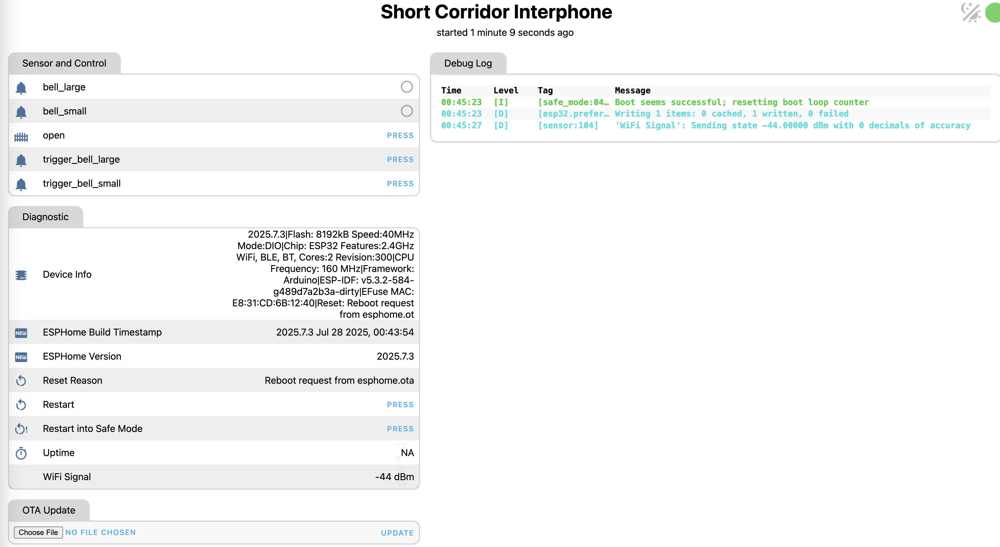
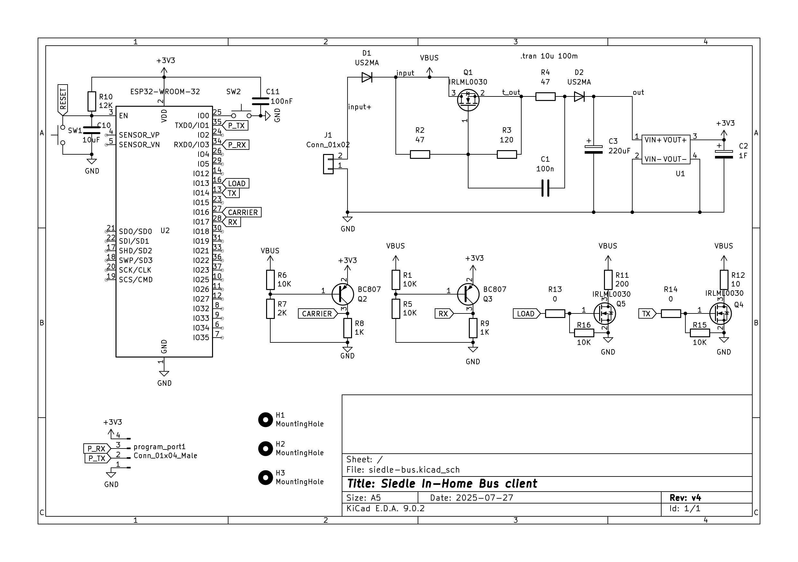
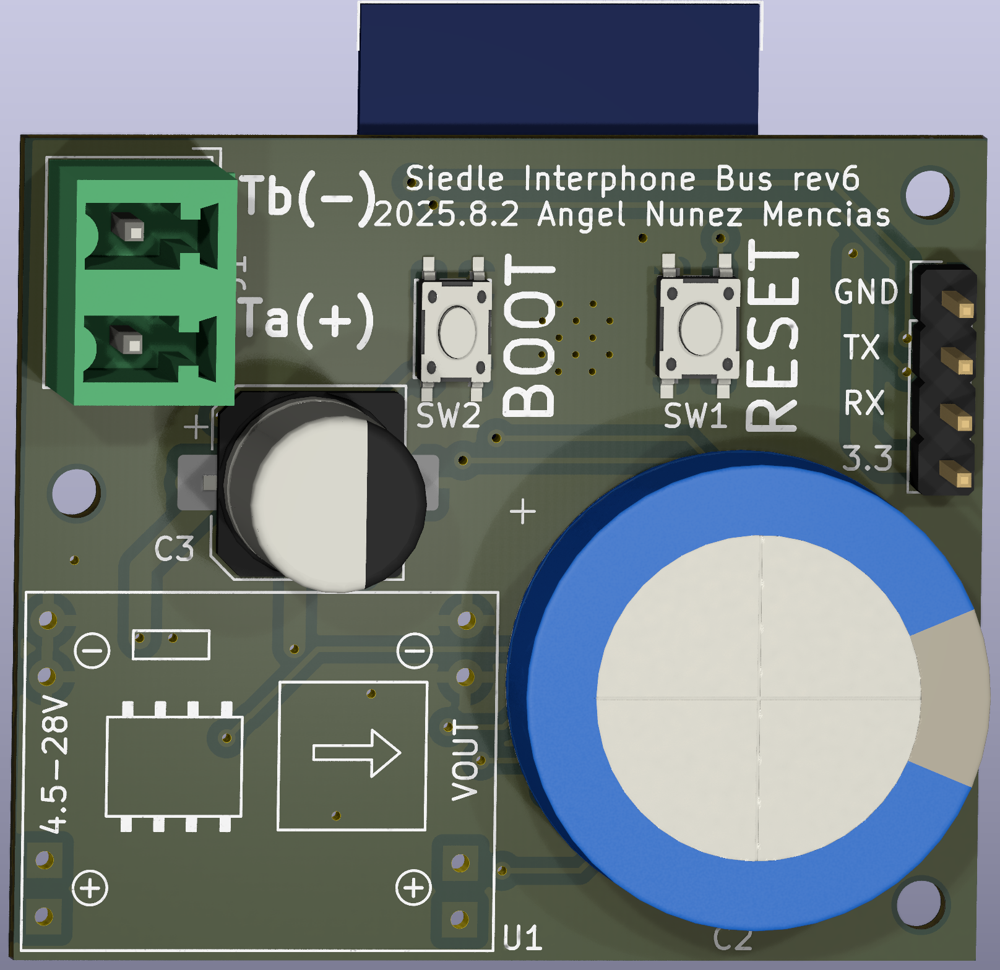
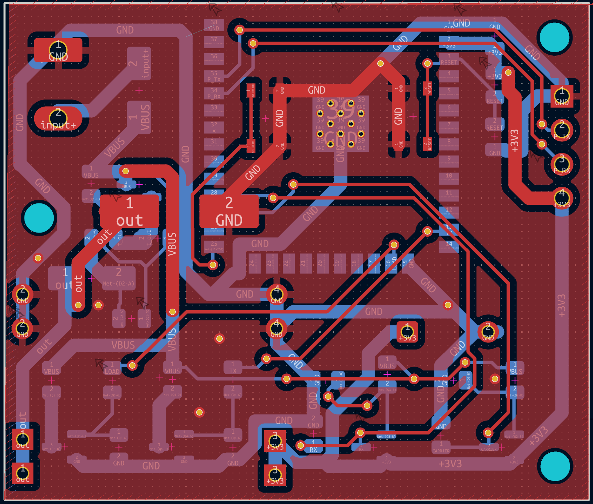
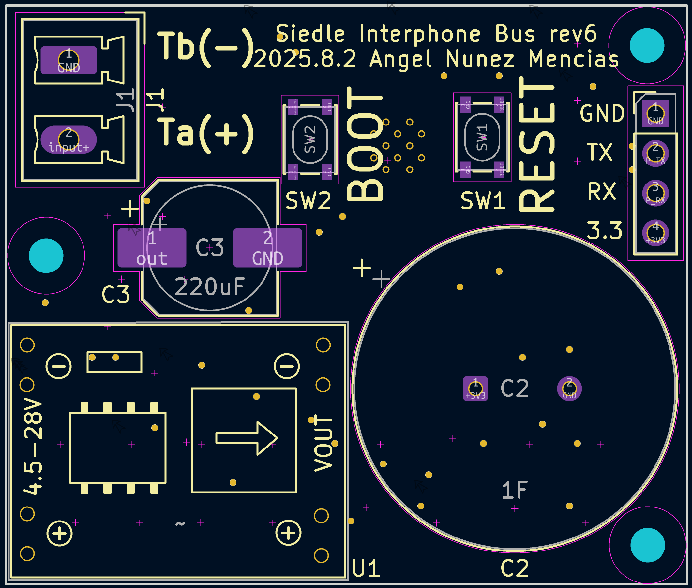
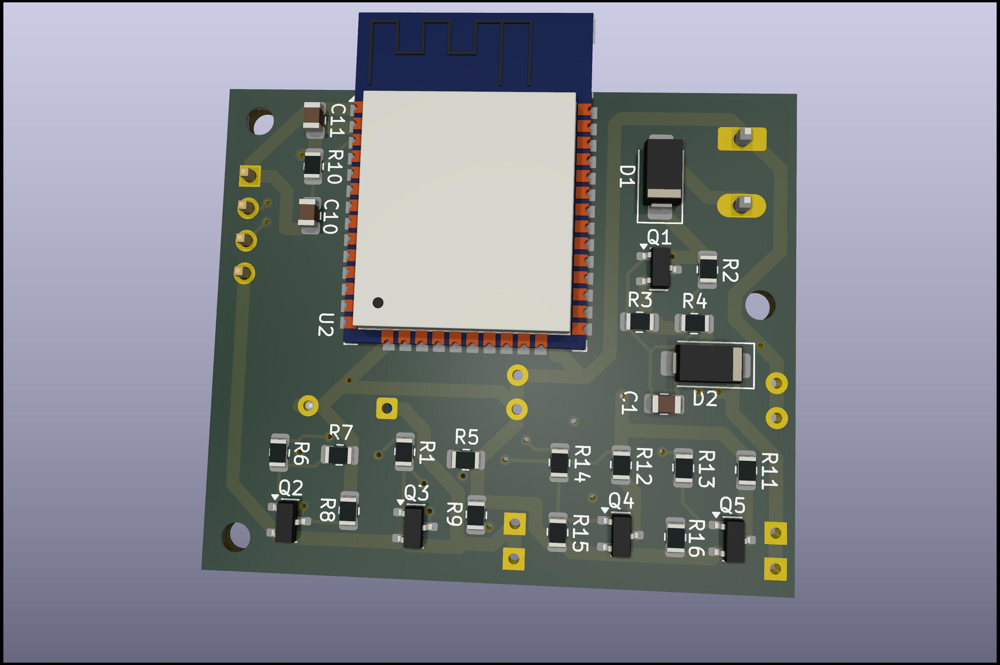
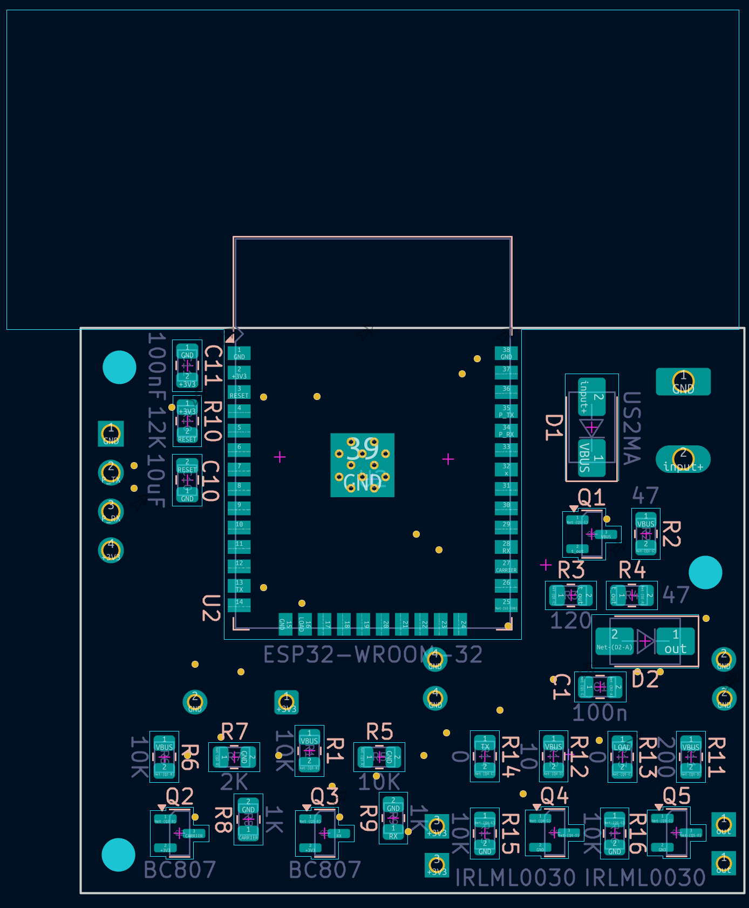
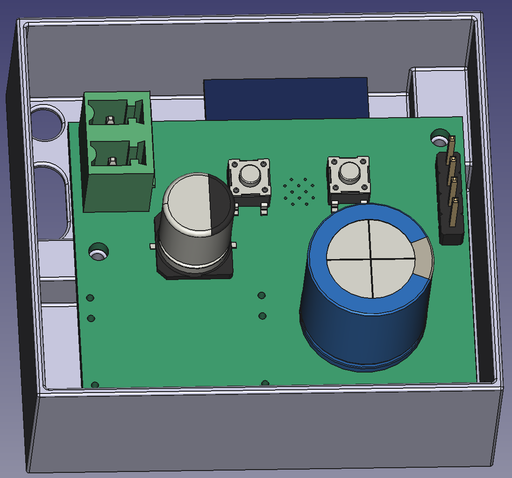

# Siedle In-Home bus client

This PCB allows interacting with a Sidle In-Home bus and automatically trigger actions or connect it to home automation such as [Home Assistant](https://www.home-assistant.io/). It uses [ESPHome](https://esphome.io) as base firmware. The power comes from the bus so no additional power supply is needed.

[Aisler PCB project](https://aisler.net/p/WQLXACYH)

KiCad PCB - schematics and assembly 

- [KiCad PCB project](kicad/siedle-bus/siedle-bus.kicad_pro)
- 
  - [Simulation of Girator](https://www.circuitlab.com/circuit/edpfjhg6bu9k/siedle-inbus-girator/)
- 
- 
- 
- 
- 
  

3D Printed Box 

- [3D Printed box](FreeCAD)
- [FreeCad file](FreeCAD/siedle-bus.FCStd)
  - fix PCB with 3x M2 screws up to 7mm long
  - use up to 3x 3mm wide screws to fix to the wall
  - cover slack: 0.15 mm (enough that it holds without screws)
  - all parameters of the box are in the Settings Spreadsheet that you can change with FreeCAD if you need to
    adjust to your case
- [3MF file - small box](FreeCAD/siedle-bus-cage.3mf)
- [3MF file - large box with placement template](FreeCAD/siedle-bus-cage_large.3mf)

Parts

- 1x [U1 - ESP32-WROOM-32 with 8MB Flash](https://www.espressif.com/sites/default/files/documentation/esp32-wroom-32_datasheet_en.pdf)
- 1x [U2 - Step-down Buck Power MP1584EN Modul](https://www.ebay.de/itm/375340664282)
- 1x [2 Pin Screw Terminal blocks](https://www.amazon.de/YIXISI-Terminal-Schraubklemme-Steckverbinder-Arduino/dp/B087RN8FDZ)
- 1x [C2 - 1F 5V Supercapacitor](https://www.ebay.de/itm/126559349843)
- 2x [C3 - 220uF Elec 8x10.5 mm capacitor](https://www.ebay.de/itm/175443736870)
- 3x [Q1, Q4, Q5 - IRLML2402 MOSFET Transistor](https://www.ebay.de/itm/114510586115)
- 2x [Q2, Q3 - BC807 PNP Bipolar Transistor](https://www.ebay.de/itm/284104594986?var=585596351672)
- 1x [program_port1 - 4 pin 2.54 mm Breakaway Board Connector Header](https://www.ebay.de/itm/272575130016)
- 1x [R10 - 0805 SMD 12 KOhms resistor (it can be 10K as well)](https://www.ebay.de/itm/305754891633)
- 5x [R1, R5, R6, 15, R16 - 0805 SMD 10 KOhms resistor](https://www.ebay.de/itm/305754891633)
- 1x [R7 - 0805 SMD 2 KOhms resistor](https://www.ebay.de/itm/305754891633)
- 2x [R8, R9 - 0805 SMD 1 KOhms resistor](https://www.ebay.de/itm/305754891633)
- 1x [R11 - 0805 SMD 200 Ohms resistor](https://www.ebay.de/itm/305754891633)
- 1x [R3 - 0805 SMD 120 Ohms resistor](https://www.ebay.de/itm/305754891633)
- 2x [R2, R4 - 0805 SMD 47 Ohms resistor](https://www.ebay.de/itm/305754891633)
- 1x [R12 - 0805 SMD 10 Ohms resistor](https://www.ebay.de/itm/305754891633)
- 2x [R13, R14 - 0805 SMD 0 Ohms resistor](https://www.ebay.de/itm/305754891633)
- 2x [C1, C11 - 0805 SMD 100 nF capacitor](https://www.ebay.de/itm/176105462805)
  

Pins

- Bus connector (ETR not used). From top to bottom:
  - Tb-
  - Ta+
- Serial programming:
  - 3.3V
  - TX
  - RX
  - GND

Firmware

- You need to modify/create your own [ESPHome.io](https://esphome.io) definition and include the [yaml in this folder](v1.yaml)
- [Example for v1.0](../../interphone_small_flat.yaml)

## Bus information

The bus uses only 2 wires for communication and powering devices. A third wire is also present but not used here.

The bus provides 27V and can power client devices for up to 15mA (in the original board circuit there is a current limiter). It is very important to ensure that a high impedance is present to AC to not affect the bus communication. This is achieved in this project using a [Girator](https://en.wikipedia.org/wiki/Gyrator). The girator in this project uses a MOSFET to implement the girator and implement a virtual coil.

To prepare the bus to send a message, the bus is first shorted with 200 Ohms. This triggers the power supply of the bus to lower the current and allow the bits of the message to be sent. To send the bits a resistor of 10 ohms in parallel to the 200 Ohms is used to signal a zero while the 200 Ohms signal a 1. Each bit is 2 ms.

The PCB in this project uses a PNP Bipolar transistor to detect the bus carrier (when the voltage is dropped) and the following message bits. An NPN MOSFET is used to add the resistors to the bus.

### Message

Each message sent in the bus has 32 bits:

- 31-29: 010
- 28-23: command
- 22-18: destination
- 17-14: destination bus
- 13-12: 010 (first bit might be 1)
- 10-06: source
- 05-02: source bus
- 01-00: 00 (first bit might be 1 - broadcast?)

### References

I used all the reverse engineering from this [mikrocontroller Forum thread (german)](https://www.mikrocontroller.net/topic/308271) as base. Thanks a lot for all that contributed there.

Example of devices using this bus:

- [aib-150-01 Vendor page](https://www.siedle.de/de-de/home/service/linked-pages/produktkatalog/tuersprechanlagen-innen/siedle-basic/aib-150-01/)

### ToDos

- [x] switch to esp-idf framework

## Changelog

### v1

- First version
