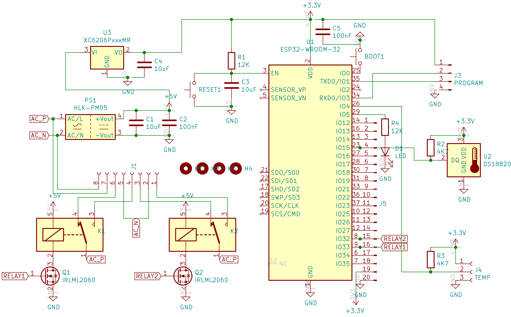

# Thermostate for 220v
This PCB allows controlling two relays based on 1 wire Dallas temperature sensors. The board has two 1-wire buses - one for the in-board sensor and one for the external sensor(s).

- [Aisler PCB project](https://aisler.net/p/ORVQXQHK)
- [KiCad schematics](KiCad/esp32-temp.sch)
  - 
- [KiCad PCB](KiCad/esp32-temp.kicad_pcb)
- [3D Printed cage](cages):
  - TBD
- Parts:
  - 1x [ESP32-WROOM-32](https://www.espressif.com/sites/default/files/documentation/esp32-wroom-32_datasheet_en.pdf)
  - nx [Temperature Sensors - DS18B20](http://datasheets.maximintegrated.com/en/ds/DS18B20.pdf)
    - the sensor in the PCB is in format TO-92. I bought mine in ebay.
    - the external sensors are attached to the connector top lef. You can get them waterprof at many places including [Amazon](https://www.amazon.de/AZDelivery-digitaler-Temperatursensor-Temperaturf%C3%BChler-wasserdicht/dp/B075FV3PQR/ref=sr_1_8?dchild=1&keywords=DS18B20&qid=1598127886&sr=8-8)
  - 2x [5v 10A Relay](http://www.sanyourelay.ca/public/products/pdf/SRD.pdf)
  - 1x [220v-5V ACDC transformer](http://www.hlktech.net/product_detail.php?ProId=59)
  - 1x [xc6206 - 3,3v 0,5A regulator in SOT-23 format](https://www.torexsemi.com/file/xc6206/XC6206.pdf)
  - 2x [IRLML2060 - N-MOSFET](https://www.infineon.com/dgdl/irlml2060pbf.pdf?fileId=5546d462533600a401535664b7fb25ee)
- PINs:
  - Header top left - external temperature sensors. From top to bottom:
    - VCC
    - Data
    - GND
  - Header right - 220v input/oputput. From top to bottom:
    - Input - common
    - Input - phase
    - Relay 1 Output - Normally Closed -> connect here if device is usually powered
    - Relay 1 Output - common
    - Relay 1 Output - Nomally Open -> connect here if device is usually turned off
    - Relay 2 Output - Normally Closed -> connect here if device is usually powered
    - Relay 2 Output - common
    - Relay 2 Output - Nomally Open -> connect here if device is usually turned off
  - Header top - all unussed ESP32 GPIOs - usefull when other external sensors or outputs are needed
- Firmware: [esphome](esphome.io)
  - You need to modify/create your own esphome definition and include the yaml in this folder matching your PCB
  - [Example for v1.1](../../thermostate1_buhardilla.yaml)
- [3D Printed cage](cages):
  - TBD

# Changelog

## v1.2
  - Address bugs from first version PCB
    - moved internal temp sensor to GPIO15
    - connected relay MOSFETs to GPIO33 (Relay 1) and GPIO32 (Relay 2)
  - Same stencil as for v1.1
## v1.1
  - First version
  - BUGS:
    - MOSFET not connected to ESP32
      - solved with wire
    - 1-wire pull-up for internal temperature sensor prevents programming
      - solved by removing pull-up
      - internal sensor still working without pull-up
