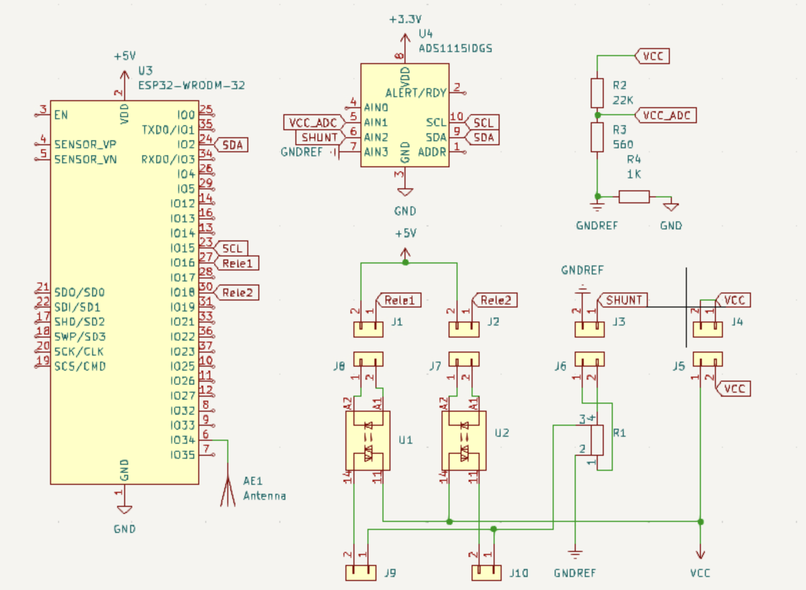

# Solar splitter

This device allows feeding a panel output or group of pannels outputs to 2 separated batteries. It does this by using solid state relays to switch between the 2 bateries to charge. In uses a shunt and an ADC to track current flow and solar voltage.

Before this device I was connecting the battery inputs in parallel to the pannels but this was not efficient, as the battery MPPTs would keep trying to adjust. As result only half of the available solar pannel power was obtained.

In addition the device includes an screen for Shunt that is independent from the esp32 (it came with the shunt) and a RF receiver for 433Mhz used to receive RF [press button](https://www.amazon.es/DieseRC-Interruptor-inal%C3%A1mbrico-interruptor-controlador/dp/B099ZRG67C) signals. Both are optional and not needed for the core function of this device.

- [KiCad schematics](KiCad/spliter_solar_panels.kicad_sch)
  - 
- Parts: 
  - 1x Generic ESP32 dev board 
    - [Amazon link](https://www.amazon.es/dp/B0D86QJ1YB)
  - 1x [ADS1115 ADC](https://www.ti.com/product/ADS1115)
    - [Amazon link](https://www.amazon.es/AZDelivery-ADS1115-canales-Arduino-Raspberry/dp/B07TY3TSBG)
  - 2x [SSR-100DD Solid state relais](https://heschen.com/products/ssr-100dd)
    - [Amazon link](https://www.amazon.es/Heschen-monof%C3%A1sico-SSR-100DD-Entrada-24-220VCC/dp/B0716S1GS8)
  - 1x Shunt with screen 
    - [Amazon link - Shunt with screen](https://amzn.eu/d/aZfakt4)
  - Resistences: R2: 22K, R3: 560, R4: 1K 
    - [Amazon set](https://amzn.eu/d/dpWQRg7)
  - PCB and terminal connectors 
    - [Amazon link](https://amzn.eu/d/82N9dl3)
  - 4x M2 screws to attach the PCB to the box 
    - [Amazon link](https://www.amazon.es/gp/product/B07NY7RFSW)
  - 1x (150x120x20mm) Aluminum Heat Sink for Solid state relais 
    - [Amazon link](https://www.amazon.es/dp/B09ND4WBZW)
  - 1x Adhesive Tape Thermal Paste Pad for Heat Sinks 
    - [Amazon link](https://www.amazon.es/dp/B01MXROKV9)
  - 1x [Wire wrapping tool](https://amzn.eu/d/avOlFWV)
  - (optional) 1x [433 Mhz receiver](https://amzn.eu/d/7OIJ6d3)
- Firmware: [esphome](esphome.io)
  - You need to modify/create your own esphome definition and include the yaml in this folder matching your PCB
  - [Example for v1](../../solar-splitter.yaml)
- [3D Printed cage](box): 
  - [FreeCad file](box/solar_panel_distribution.FCStd)
  - [Box inside - 3MF file](box/solar_panel_distribution-inside_box.3mf)
    
    
- Mount photos: 
  - [3D Printed cage](box): 
  - 

# Changelog

## v1

- First version
- No PCB - used wire-wrapping to ensamble